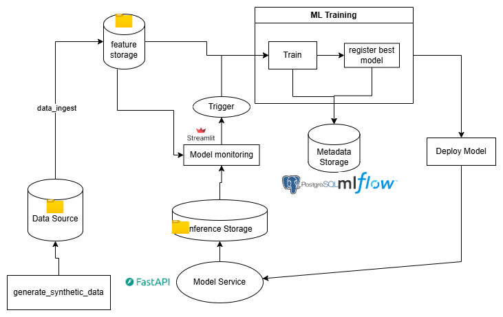
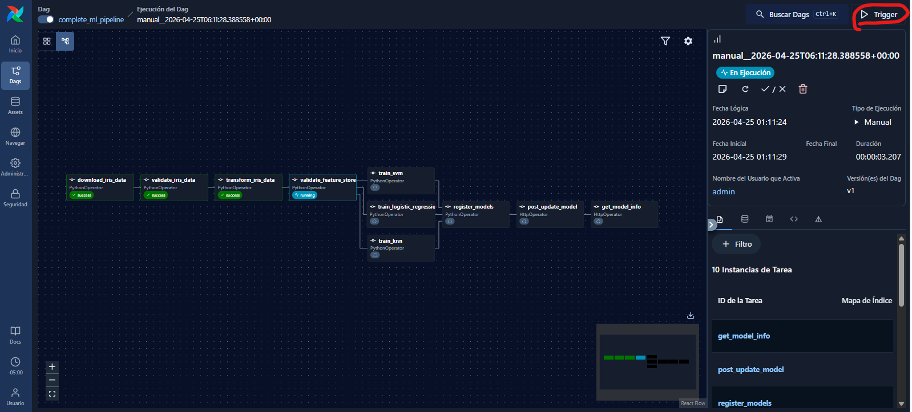
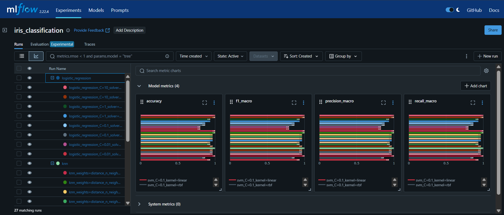
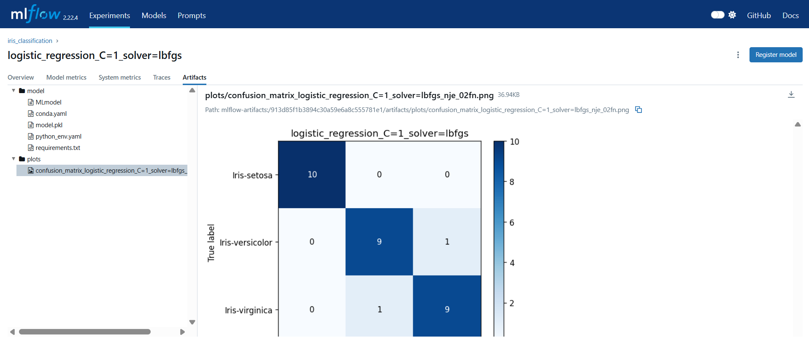
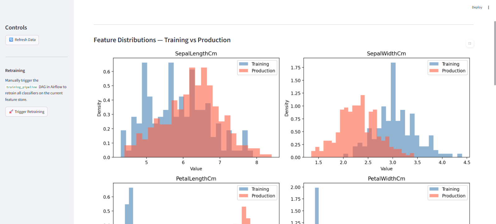
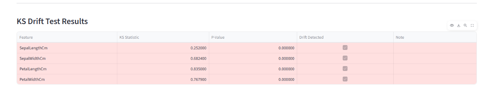

# Project Notes — Iris ML Platform

## Tech Stack & Component Roles

| Technology | Role in the project |
|---|---|
| **Apache Airflow 3** | Orchestration engine for the five DAGs in the repo: `data_ingest`, `complete_ml_pipeline`, `training_pipeline`, `generate_synthetic_data`, and `monitor_prediction_drift`. Handles scheduling, retries, and manual. |
| **MLflow** | Experiment tracking and model registry. Logs metrics, parameters, and artifacts for every training. |
| **FastAPI** | Inference server. Exposes `POST /predict`, `GET /info`, and `POST /update_model`. It also appends every prediction to `predicted.csv`. |
| **Streamlit** | Drift monitoring dashboard. Reads the training slice from the feature store using the `training_dates` tag when available, compares it against live prediction traffic, and offers a manual retraining trigger. I Used Streamlit because it is easy to run locally and lets us build a simple interface quickly. |

---

  
   <em>End-to-end MLOps architecture — services, DAGs, and data flows</em>

## DAGs Reference

### `data_ingest`
**Trigger:** Manual only.

Handles the full ingestion cycle for the Iris dataset without any training step. Supports two data sources controlled by the `data_source` param:
- `kaggle` (default) — downloads the dataset directly from the Kaggle API, extracts `Iris.csv`, and processes it.
- `synthetic` — reads `/public/source_data/simulated.csv` produced by `generate_synthetic_data`.

The `on_validation_error` param controls how Pandera schema violations are handled (`fail` stops the pipeline; `drop_invalid_rows` sanitises the dataset and continues). The `write_mode` param (`overwrite` or `append`) controls how the processed records are written to `features_iris.csv`.

Task graph: `download_iris_data → validate_iris_data → transform_iris_data`

---

### `complete_ml_pipeline`
**Trigger:** Manual only.

Bootstrap DAG for a full end-to-end run: ingests data from Kaggle, validates the resulting feature store, and then trains SVM, Logistic Regression, and KNN classifiers in parallel via `GridSearchCV`. Each training run is logged to MLflow, the best model per family is registered, the `@champion` alias is assigned, and the inference API is hot-reloaded via `POST /update_model`.

This is the entry point to use when starting from scratch with no existing feature store or champion model.

Task graph: `download_iris_data → validate_iris_data → transform_iris_data → validate_feature_store → [train_svm ‖ train_logistic_regression ‖ train_knn] → register_models → post_update_model → get_model_info`

---

### `training_pipeline`
**Trigger:** Manual or automatic (triggered by `monitor_prediction_drift` when drift is detected).

Train-only DAG that assumes a valid feature store already exists. Validates the feature store, trains the three classifiers in parallel, registers the best model per family in MLflow, updates the `@champion` alias only if the new model strictly improves `f1_macro` over the current champion, and notifies the inference API to hot-reload.

The `training_data` param (`all` or `latest`) controls whether the full feature store or only the most recent ingestion batch is used for training.

Task graph: `validate_feature_store → [train_svm ‖ train_logistic_regression ‖ train_knn] → register_models → post_update_model → get_model_info`

---

### `generate_synthetic_data`
**Trigger:** Manual only.

Generates a synthetic Iris dataset and populates the prediction store for drift-monitoring tests. Has two responsibilities:
1. **Generate** — produces `/public/source_data/simulated.csv` using UCI Gaussian parameters.
2. **Simulate** — sends all valid rows to `POST /predict` on the inference API, which logs each prediction to `predicted.csv`.

Three modes are available via the `mode` param:
- `normal` — balanced classes, standard distribution → predictions follow training distribution → no drift triggered.
- `drifted` — `PetalLengthCm` shifted +2.5 cm, `PetalWidthCm` +1.0 cm, class proportions 10/20/70 % → KS p-values << 0.05 → drift detected.
- `dirty` — balanced proportions with injected nulls, negative values, invalid species labels, and duplicates. Only valid rows are forwarded to the API.

Task graph: `generate_and_save → send_predictions_to_api`

---

### `monitor_prediction_drift`
**Trigger:** Daily (`@daily`).

Implements data drift monitoring: compares the feature distributions of real production requests (logged in `predicted.csv`) against the exact training distribution of the current `@champion` model. The reference distribution is built by filtering `features_iris.csv` to the `processed_at` dates stored in the `training_dates` tag on the champion model version in MLflow, preventing false positives from accumulated batches that were not part of the last training run.

A two-sample KS test is run per feature column. If any feature has `p < 0.05`, drift is flagged and `training_pipeline` is triggered automatically. The test is skipped gracefully when either CSV is missing or contains fewer than 30 rows.

Task graph: `detect_prediction_drift → should_retrain (ShortCircuitOperator) → trigger_training_pipeline (TriggerDagRunOperator)`

---

## Assumptions

- The `/public` bind-mount acts as a lightweight shared filesystem. This is fine for local development, but a production deployment would use object storage or a managed feature store.
- The local stack uses Airflow with CeleryExecutor and a dedicated `airflow-worker`; the `flower` service is optional and only starts with its profile.
- `complete_ml_pipeline` is the bootstrap path and expects Kaggle access. `generate_synthetic_data` is a post-bootstrap traffic simulator because it POSTs to `/predict`.
- The dataset is small enough that a CSV feature store is sufficient. No Parquet/Delta dependency is assumed.
- Drift is detected at the feature distribution level only (covariate drift). Label feedback is not available, so concept drift cannot be measured yet.
- The API can legitimately return HTTP 503 before the first training run because no champion model exists yet.
- The `@champion` alias is updated only when the new model strictly improves `f1_macro` over the current champion, preventing regressions from scheduled retraining runs triggered by drift.

---

## Data Drift Simulation — Design Rationale

The `generate_synthetic_data` DAG with `mode=drifted` simulates the kind of distributional shift that could realistically occur in production. It is meant to run after the API already has a champion model, because it posts the generated rows to `/predict`:

- **New measurement regions:** If Iris flowers are sampled from a different geographic region, petal dimensions may follow a different distribution than the UCI training set.
- **Seasonal or environmental changes:** Flowers growing under different temperature or humidity conditions can develop larger or smaller petals over time, gradually shifting the input distribution.

The simulation shifts `PetalLengthCm` by +2.5 cm and `PetalWidthCm` by +1.0 cm, and skews the class proportions, which is sufficient to push the KS test p-values well below 0.05 and trigger automatic retraining — demonstrating the full drift detection → retraining loop without requiring real labeled data from a new source.

---

## Use Case

### 1. Run the first flow

Open the Airflow UI at http://localhost:8080 and launch `complete_ml_pipeline` to walk through the end-to-end flow step by step.

  
   <em>Airflow graph view — <code>complete_ml_pipeline</code> running with parallel SVM / LR / KNN training tasks</em>

### 2. Review experiments in MLflow

Open the MLflow UI at http://localhost:5001 and inspect the `iris_classification` experiment.

In the experiment view you can:  
- Compare runs by metrics such as accuracy, precision, recall, and F1.

  
   <em>MLflow run comparison — accuracy, precision, recall and F1 for all three model families</em>

- Open the artifact tab to inspect the confusion matrix image and any saved outputs.

  
   <em>Confusion matrix logged as an artifact for each training run</em>

- Check the registered model versions and verify which one is assigned to `@champion`.

### 3. Simulate data drift

Use `generate_synthetic_data` with `mode=drifted` to create shifted input data and send prediction traffic to the API at http://localhost:8000/predict.

### 4. Re-ingest the adapted batch and reactivate training

Run `data_ingest` with `data_source=synthetic` so the new batch is read from `simulated.csv` and written back to the feature store at `http://localhost:8080`.

Make sure `monitor_prediction_drift` is enabled and that `training_pipeline` can be triggered, so the training loop is reactivated when drift is detected.

### 5. See the new model upload

Open the MLflow UI at http://localhost:5001 and verify that the new model version was registered and the `@champion` alias moved to it.

### 6. View the drift results

Open the Streamlit drift monitor at http://localhost:8501 to inspect the feature distributions, KS test results, and retraining controls.

  
   <em>Streamlit drift monitor — training vs production distributions show clear petal feature shift after drifted data</em>

  
   <em>KS drift test results — all four features flagged as drifted (p-value = 0.000)</em>

### 7. Handle corrupt data

Trigger `generate_synthetic_data` with `mode=dirty` to create a batch with nulls, negative values, invalid species labels, and duplicates.

Then run `data_ingest` from http://localhost:8080 with `data_source=synthetic` to read the dirty batch from `simulated.csv`.

If `on_validation_error=fail`, the pipeline stops at `validate_iris_data` and the validation errors are shown in the Airflow logs.

If `on_validation_error=drop_invalid_rows`, the invalid rows are removed, a cleaned file is pushed through XCom, and `transform_iris_data` writes only valid records to the feature store.

---

## What would I do with more time, and how could the system be scaled as the project grows?

### 1. Proper Feature Store

Replace the CSV-based feature store with a dedicated tool such as **Feast**. A real feature store provides:

- Point-in-time correct feature retrieval (prevents data leakage between training and serving).
- Feature versioning and lineage tracking.
- Online/offline store separation — the online store serves low-latency features to the API; the offline store feeds batch training jobs.
- Feature sharing across multiple models and teams.

### 2. Data Versioning with DVC

Integrate **DVC (Data Version Control)** to version the datasets and feature store alongside the model artifacts. Each training run would reference an explicit DVC data version, making it possible to:

- Reproduce any past training run exactly (same data + same code + same hyperparameters).
- Audit which data was used to produce a specific model version registered in MLflow.
- Roll back to a previous feature store snapshot if a bad data batch corrupts the store.

DVC remote storage would be backed by S3 in a cloud deployment.

### 3. Distributed Ingestion and Scalable Training

As data volume grows or model complexity increases, the current single-machine approach hits limits:

- **Apache Spark** for data ingestion and feature engineering — distributed data validation, transformation, and deduplication across large amounts of data, replacing the pandas-based pipeline.
- **On-demand training jobs** with AWS SageMaker Training Jobs to launch training on dedicated GPU/CPU instances and shut them down when done, paying only for actual compute time.
- The Airflow DAGs would remain as the orchestration layer, calling Spark jobs and cloud training APIs rather than running computation directly in the worker containers.

### 4. Concept Drift Monitoring

The current system detects **data drift** (input feature distribution shifts). A complete monitoring solution would also track **concept drift**.

### 5. Better Data Drift Visualization

For drift analysis, I would complement or replace the custom Streamlit charts with a dedicated tool such as **Evidently AI**. It is better suited for Data Drift because it can generate richer batch comparison reports, feature distribution visualizations, and shareable HTML dashboards for both technical and non-technical reviewers.
